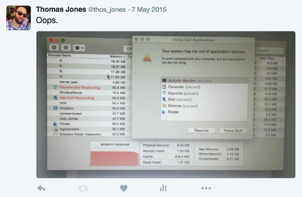

```{r setup, include=FALSE, fig.height=4, fig.width=5, fig.align="center", error=FALSE, message=FALSE, warning=FALSE, results="hide"}
knitr::opts_chunk$set(echo = TRUE)
library(textmineR)
```

# 1 Introduction

Introduction goes here

# 2 Mathematical Structures for Natural Language Processing

Two core mathematical structures in Natural Language Processing (NLP) are the document term matrix (DTM) and the term co-occurence matrix (TCM). A DTM is a matrix whose rows index documents and whose columns index linguistic features of these documents. These linguistic features called "terms", though they may be single words, groups of words called "n-grams", stems, lemmas, or other tokens. The $(i, j)$ entries of a document term matrix are a frequency measure of term $j$ within document $i$, for example the number of times term $j$ is used within document $i$. A TCM is a square, but not necessarily symmetric, matrix whose rows and columns both index terms. The $(i, j)$ entries of a TCM represent a relationship between term $i$ and term $j$, for example the number of times term $j$ appears within $n$ places of term $i$. 

The core of many NLP tasks comes from the decision to make a DTM or a TCM and the definitions of rows, columns, and frequency measures of the DTM or TCM. From there an additional algorithm may be run or statistical model fit to the DTM or TCM. Some choices for common NLP tasks are below.

**Probabilistic topic modeling**

* DTM
* Rows are whole documents.
* Columns are unigrams or unigrams and bigrams
* Frequency measure is a raw integer count
* A probabilistic topic model, such as Latent Dirichlet Allocation (LDA), is applied to the DTM
  
**Latent semantic analysis (LSA)**

* DTM
* Rows are whole documents
* Columns are unigrams or unigrams and bigrams
* Frequency measure is a TF-IDF^[Term freqeuncy inverse document frequency (TFIDF) is a reweighting where common words are penalized and rare words are promoted.] reweighting
* The DTM is factored by single-value decomposition (SVD)

**Calculating word embeddings**

* TCM
* Rows and columns are unigrams
* Frequency measure is the number of times term $j$ appears within 3 places of term $i$
* The TCM is de-composed by a method such as GloVe^[cite] or Word2Vec^[cite]

**Document summarization**

* DTM
* Each row is a sentence from a single document
* Columns are stems^[Footnote or citation] or lemmas^[footnote or citation]
* Frequency measure is TF-IDF reweighting
* Sentences (rows) are clustered, with cluster exemplars being chosen as a document summary.


# 3 Scaleability Issues in Natural Language Processing

The conceptual simplicity of DTMs and TCMs contrasts the computational challenges of NLP in practice. Linguistic data is large and sparse. It is common to have a DTM with 20, 80, or more times more terms than documents. Consider the sample NIH data included with `textmineR`. It has 100 documents. Without removing stopwords, a DTM of unigrams has 5,542 columns. A DTM of unigrams and bigrams from this corpus has 30,004 columns. A matrix of 100 rows and 30,004 columns easily fits in RAM. However, the number of unique terms in a corpus tends to grow exponentially with the number of documents. This is driven by a process known as Zipf's law^[cite.]. Zipf's law means that in any corpus there are a handful of terms used almost always and many many terms used hardly ever. This leads to matrices that, if not stored efficiently, can quickly outpace available RAM. The below image depicts the result of trying to allocate memory for a matrix (corpus) with 100 thousand rows (documents) and 6 million terms (columns). Clearly memory-efficient data types are required for NLP. However, this raises a barrier to entry for those interested in NLP.



Computation time is also an issue in NLP, requiring the use of parallel computing. It is good that many NLP computation tasks are embarassinly parallel. Like memory-efficient data storage, parallel computing is a more advanced topic. These two properties make it difficult for many to perform NLP, even though it is often conceptually simple. 

# 4 An Ideal Approach to Natural Language Processing in R
An ideal NLP framework for R should have the following characteristics: It should be easy to use for an experienced R programmer. It should be maximally interoperable with other R packages, instead of being its own ecosystem. Its syntax should be intuitive for experienced R users. Finally, it should scale for large NLP tasks. `textmineR` is a best effort at these characteristics. Used in conjunction with the `text2vec` library, the framework espoused by `textmineR` scales for corpora much larger than available RAM.

## 4.1 The standard NLP pipeline

## 4.2 Interoperability within R's ecosystem
To aid interoperability within R's ecosystem, `textmineR` makes use of data types available in the `base` package wherever possible. In the case of DTMs and TCMs, it employs the `dgCMatrix` from the `Matrix` package. `dgCMatrix` objects are widely-adopted and have many methods whose syntax parallels methods available for `matrix` objects in the `base` package.

### 4.2.1 Corpus and metadata management
R has two core data types well-suited for storing documents and metadata: data frames and lists. A corpus with relatively simple metadata may be stored as a data frame, with one variable containing the text of the documents. An example is the sample NIH dataset included with `textmineR`^[cite.]. This dataset, callable by `data(nih_sample)` is stored as a data frame. There are five columns containing unstructured or semi-structured textual data: `ABSTRACT_TEXT`, `NIH_SPENDING_CATS`, `PROJECT_TERMS`, `PHR`, and `PROJECT_TITLE`. These columns are described in the table below. The `nih_sample` dataset contains 39 additional columns of metadata. Metadata include administrative information, geographic information, temporal information, and more. More complex metadata may be stored in a list. There is no need for any special corpus object with its own functions and methods. R's `base` library has this covered.

| Variable Name | Variable Descripton |
|---------------|---------------------|
|`ABSTRACT_TEXT`| The free-text abstract of an NIH-funded research project|
|`NIH_SPENDING_CATS`| Several key words tagged by NIH to the corresponding project corresponding to NIH's reports of spending to Congress|
`PROJECT_TERMS`| Additional key words tagged to the corresponding project|
|`PHR`| The free-text field describing the public-health relevance of the corresponding research project|
|`PROJECT_TITLE`| The free-text title of the research project|

### 4.2.2 Sparse matrices for DTMs and TCMs
The `dgCMatrix` 


`textmineR` need not be _the_ framework for NLP in R. By building packages that operate on `dgCMatrix` objects, any number of packages can develop NLP techniques. `textmineR` and `text2vec` are already two libraries using `dcCMatrix` sparse matrices. In fact, `textmineR`'s functions `CreateDtm` and `CreateTcm` are wrappers simplifying the syntax (at the expense of some flexibility) of `text2vec`.

## 4.3 `textmineR`'s philosophy on syntax

## 4.4 Scaling `textmineR`


# 5 Why `textmineR` Improves on `tm` and other NLP Frameworks
The [CRAN Task View on Natural Language Processing](https://cran.r-project.org/web/views/NaturalLanguageProcessing.html) promotes the `tm` package as a standard framework for NLP in R. Specifically it states

> In recent years, we have elaborated a framework to be used in packages dealing with the processing of written material: the package `tm`. Extension packages in this area are highly recommended to interface with `tm`'s basic routines and useRs are cordially invited to join in the discussion on further developmens of this framework package.

`tm` is thoroughly programmed and well-established, having been around since at least 2008^[cite JSS paper]. It has 29 reverse imports^[Including `textmineR`] and depends as of this writing. `tm` has thorough vignettes demonstrating `tm`'s applicability to many use cases in NLP and instructions for writing extensions to `tm`. The `tm` package shines in its extensions for platforms such as LexisNexis^[See package `tm.plugin.lexisnexis` on CRAN], Factiva^[See package `tm.plugin.factiva` on CRAN] and more. 

Yet the `tm` package has two less-than-desireable properties: it is excessively object-oriented and it uses a somewhat esoteric data structure&mdash;with esoteric methods&mdash;as its sparse matrix data type. Unfortunately, this leads to a syntax that does not feel like an "R way" of doing things. The learning curve can be steep, even if the user is an experienced R programmer. 

Consider the case of importing documents into `tm`'s framework as an example. Users cannot create a DTM directly from a character vector or other core R data type. Instead, they must first create a `Corpus` object. This `Corpus` object is designed to hold the text and metadata of documents. (This report argues that a `data.frame` or `list` is sufficient. More on this in the next section.) As a prerequisite for creating a `Corpus`, users must first create a `Source` object. There are different methods and functions for creating a `Source` object, depending on how the documents are stored internally or externally to R. Readers of this report may type `help(Source, package = "tm")` or `help(Corpus, package = "tm")` to see the complexity of these objects. Typing `help(meta, package = "tm")` gives insight to `tm`'s approach to metadata management.

The below code shows the differences in creating a DTM with `tm` and `textmineR`. The syntax of `textmineR` is much simpler, with transformations being passed as arguments to a single function. See section 6 for a deeper discussion of `textmineR`'s `CreateDtm` function and on extending the framework employed by `textmineR` through the `text2vec` library.

```{r tm_dtm_textminer_dtm, eval = FALSE}
data(nih_sample)

docs <- nih_sample$ABSTRACT_TEXT

names(docs) <- nih_sample$APPLICATION_ID

stopwords <- c(tm::stopwords("english"), tm::stopwords("SMART"))

### Creating a DTM with the tm package from a character vector -----------------

# Create a corpus object from a vector source
corp <- tm::Corpus(tm::VectorSource(docs))

# Perform document curation, lowering, removing non-alpha character, 
# revmoval of stopwords, etc.
corp <- tm::tm_map(corp, tm::content_transformer(tolower))

corp <- tm::tm_map(x=corp, tm::removeWords, stopwords)

corp <- tm::tm_map(corp, tm::removePunctuation)

corp <- tm::tm_map(corp, tm::removeNumbers)

corp <- tm::tm_map(corp, tm::stripWhitespace)

# Create a final DTM
dtm <- tm::DocumentTermMatrix(corp)


### Creating a DTM with the textmineR package from a character vector ----------

# note lowering, removal of non-alpha characters is the default behavior
dtm <- CreateDtm(doc_vec = docs,
                 ngram_window = c(1, 1),
                 stopword_vec = stopwords,
                 lower = TRUE,
                 remove_punctuation = TRUE,
                 remove_numbers = TRUE)
```


It is clear from the two types of `Corpus` object, that the makers of `tm` are concerned with scaleability issues. `Corpus` objects of type `VCorpus` are desinged to be held in RAM, whereas `Corpus` types of `PCorpus` are designed to be held on disk, facilitating analyses of massive corpora. For most users, this much data is an exception rather than the rule. (cite HH analyzing the analyzers) It compels the question of whether or not the additional complexity and overhead are necessary for a corner case.

The `tm` package stores DTMs as a `simple_triplet_matrix` object from the `slam` package. Simple triplet matrices are a form of sparse matrix where only non-zero entries are stored. The "triplet" comes from the three standard columns: `i` is a row index, `j` is a column index, and `v` for the value at the `(i,j)` position. `(i,j)` entries that are not indexed in the `i` and `j` columns are assumed to be zero. There are two limitations to `slam`'s `simple_triplet_matrix` class, however. Methods and functions for matrix manipulation and matrix math differ significantly from standard R dense matrices. This, again, makes for a steeper learning curve even when users are experienced R programmers. Second, `simple_triplet_matrix` objects are less-commonly used than other sparse matrix classes, notably from the `Matrix` package. (More on this in the next section.) This limits the availability of out-of-the-box statistical methods that can be performed on a DTM created by the `tm` package. 

The figure below illustrates 

```{r matrix_compare, echo=FALSE, cache=TRUE, fig.height=4, fig.width=5, fig.align="center", error=FALSE, message=FALSE, warning=FALSE}

library(magrittr)

matrix_page <- scan("https://cran.r-project.org/web/packages/Matrix/index.html", 
                    what="", sep="\n")

slam_page <- scan("https://cran.r-project.org/web/packages/slam/index.html", 
                    what="", sep="\n")

CountUse <- function(x){
  
  # paste everything together
  result <- paste(x, collapse = "\n")
  
  # use some regex to remove html etc
  result <- result %>% 
    stringr::str_replace_all("<[^<>]+>", " ") %>%
    stringr::str_replace_all(" +", " ")
  
  # Find the relevant sections & isolate their contents
  result <- stringr::str_split(result, "\n")[[ 1 ]]
  
  loc <- which(stringr::str_detect(result, "Reverse dependencies:"))
  
  result <- result[ (loc + 1):length(result) ]
  
  result <- result[ ! stringr::str_detect(result, "Reverse\\&") ]
  
  result <- result[ ! result == " " ]
  
  result <- unlist(stringr::str_split(result, ",| "))
  
  # Count the number of dependencies
  length(unique(result))
  
}

matrix_count <- CountUse(matrix_page)

slam_count <- CountUse(slam_page)

y <- c(matrix_count, slam_count)

z <- barplot(y,
             names.arg = c("Matrix", "slam"),
             main="Number of Reverse Dependencies,\nImports, Suggests, etc.",
             col="steelblue", cex.names = 1.5, yaxt="n",
             ylim = c(0, max(y) + 100))
text(x=c(z[1, ], z[2, ]), 
     y = y + par("cxy")[2]/1.1, 
     labels = round(y, 2),
     cex=1.25, 
     xpd=TRUE)
```


# 6 An Overview of `textmineR`'s Functions

## 6.1 `textmineR`'s core functions: `CreateDtm` and `CreateTcm`

`textmineR` has two core functions. `CreateDtm` creates document term matrices from a character vector. `CreateTcm` creates term co-occurence matrices from a character vector. Both functions have arguments allowing users to remove stop words, remove numbers, remove punctuation, tokenize unigrams and n-grams on spaces, convert terms to lowercase, an pass custom stemming and lemmatization functions. In addition, both automatically make use of parallelism on Windows and Unix-based operating systems. This parallelism is executed at the C++ level through `text2vec` and at the R level through `textmineR`'s `TmParallelApply` function. 


```{r dtm_times, echo=FALSE, cache=TRUE, fig.height=4, fig.width=5, fig.align="center", error=FALSE, message=FALSE, warning=FALSE}

strawman_fun <- function(docs){
  names(docs) <- 1:length(docs)
  stopwords <- c(tm::stopwords("english"), tm::stopwords("SMART"))
  corp <- tm::Corpus(tm::VectorSource(docs))
  corp <- tm::tm_map(corp, tm::content_transformer(tolower))
  corp <- tm::tm_map(x=corp, tm::removeWords, stopwords)
  dtm <- tm::DocumentTermMatrix(corp)
  dtm
}

data(nih_sample, package="textmineR")

strawman_times <- sapply(1:10, function(x){
  system.time(strawman_fun(nih_sample$ABSTRACT_TEXT))
})

textminer_times <- sapply(1:10, function(x){
  system.time(textmineR::CreateDtm(doc_vec = nih_sample$ABSTRACT_TEXT,
                                   remove_punctuation = FALSE,
                                   remove_numbers = FALSE))
})

y <- c(mean(strawman_times[ "elapsed" , ]), mean(textminer_times[ "elapsed" , ]))

z <- barplot(y,
             names.arg = c("tm", "textmineR"),
             main="Mean Seconds to Create a DTM\nof 500 NIH Grant Abstracts",
             col="steelblue", cex.names = 1.1, yaxt="n",
             ylim = c(0, max(y) + 0.1))
text(x=c(z[1, ], z[2, ]), 
     y = y + par("cxy")[2]/1.1, 
     labels = round(y, 2),
     cex=1.25, 
     xpd=TRUE)

# round(y[ 1 ] / y[ 2 ], 1)
```


## 6.2 Topic models available in `textmineR`

### 6.2.1 Latent Semantic Analysis 
```{r lsa, eval = F}
data(nih_sample_dtm)

lsa <- FitLsaModel(dtm = nih_sample_dtm, k = 10)


```

### 6.2.2 Latent Dirichlet Allocation

```{r lda_gibbs, eval = F}
data(nih_sample_dtm)

# LDA Model with Gibbs Sampling
lda <- FitLdaModel(dtm = nih_sample_dtm, k = 10, alpha = 0.1, beta=0.05,
                   method = "gibbs")
```

```{r lda_vem, eval = F}
data(nih_sample_dtm)

# LDA Model with Variational EM
lda <- FitLdaModel(dtm = nih_sample_dtm, k = 10, alpha = 0.1, beta = 0.05,
                   method = "vem")
```


### 6.2.3 Correlated Topic Models

```{r ctm, eval = F}
data(nih_sample_dtm)

ctm <- FitCtmModel(dtm = nih_sample_dtm, k = 10)


```


### 6.2.4 Document Clustering as a Topic Model

```{r clust_as_topic_model, eval = F}
data(nih_sample)
data(nih_sample_dtm)

# Take the IC_NAME column as a clustering of abstracts
model <- Cluster2TopicModel(dtm = nih_sample_dtm, 
                            clustering = nih_sample$IC_NAME)


```


## 6.3 Topic model utility functions in `textmineR`

### 6.3.1 `CalcTopicModelR2`
```{r r2, eval = F}
data(nih_sample_dtm) 
data(nih_sample_topic_model)

# Get the R-squared of the model
r2 <- CalcTopicModelR2(dtm = nih_sample_dtm, 
                     phi = nih_sample_topic_model$phi, 
                     theta = nih_sample_topic_model$theta)
```

### 6.3.2 `CalcLikelihood`
```{r likelihood, eval = FALSE}
data(nih_sample_dtm) 
data(nih_sample_topic_model)

# Get the likelihood of the data given the fitted model parameters
ll <- CalcLikelihood(dtm = nih_sample_dtm, 
                     phi = nih_sample_topic_model$phi, 
                     theta = nih_sample_topic_model$theta)
```

### 6.3.3 `CalcProbCoherence`

```{r pcoh, eval = FALSE}
data(nih_sample_topic_model)
data(nih_sample_dtm) 

CalcProbCoherence(phi = nih_sample_topic_model$phi, 
                  dtm = nih_sample_dtm, 
                  M = 5)

```


### 6.3.4 `CalcPhiPrime`

```{r phi_prime, eval = FALSE}
data(nih_sample_topic_model) 
data(nih_sample_dtm)

# Make a phi_prime matrix, P(topic|words)
phi_prime <- GetPhiPrime(phi = nih_sample_topic_model$phi, 
                         theta = nih_sample_topic_model$theta,
                         p_docs = rowSums(nih_sample_dtm))
```


### 6.3.5 `GetTopTerms`

```{r top_terms, eval = FALSE}
data(nih_sample_dtm)
data(nih_sample_topic_model) 

top_terms <- GetTopTerms(phi = nih_sample_topic_model$phi, 
                         M = 5)
```


### 6.3.6 `LabelTopics`

```{r label_topics, eval = FALSE}
data(nih_sample)
data(nih_sample_topic_model)

# Create a new DTM with n-grams only
dtm_ngram <- CreateDtm(nih_sample$ABSTRACT_TEXT, 
                 doc_names = nih_sample$APPLICATION_ID,
                 ngram_window = c(2, 2))

# Create a matrix of assignments that give a hard in/out topic assignment per document
assignments <- t(apply(nih_sample_topic_model$theta, 1, function(x){
  x[ x < 0.05 ] <- 0
  x / sum(x)
}))

# Label topics with our new n-gram DTM
labels <- LabelTopics(assignments = assignments, dtm = dtm_ngram, M = 2)

```


## 6.4 Broadly-applicable functions available in `textmineR`

### 6.4.1 `CalcHellingerDist`

```{r hell_dist, eval = FALSE}
# Generate some random vectors
x <- rchisq(n = 100, df = 8)

y <- x ^ 2

mymat <- rbind(x, y)

# Get the Hellinger distance between them
CalcHellingerDist(x = mymat)

```


### 6.4.2 `CalcJSDivergence`

```{r jsd, eval = FALSE}
# Generate some random vectors
x <- rchisq(n = 100, df = 8)

y <- x ^ 2

mymat <- rbind(x, y)

# Get the Jensen-Shannon Divergence between them
CalcJSDivergence(x = mymat)
```

### 6.4.3 `Dtm2Docs`

```{r dtm2docs, eval = FALSE}
data(nih_sample)
data(nih_sample_dtm) 

# see the original documents
nih_sample$ABSTRACT_TEXT[ 1:3 ]

# see the new documents re-structured from the DTM
new_docs <- Dtm2Docs(dtm = nih_sample_dtm)

new_docs[ 1:3 ]

```


### 6.4.4 `TmParallelApply`

```{r tmparallelapply, eval = FALSE}

```


### 6.4.5 `RecursiveRbind`

```{r recursiverbind}

```


## 6.5 Using `textmineR` with other NLP frameworks


# 7 Examples

## 7.1 Document Clustering

Describe document clustering

describe dtm creation and vocab curation

```{r doc_clust1, cache=TRUE}

data(nih_sample)

# Create a DTM of abstracts with unigrams and bigrams, stopwords removed
dtm <- CreateDtm(doc_vec = nih_sample$ABSTRACT_TEXT, 
                 doc_names = nih_sample$APPLICATION_ID,
                 ngram_window = c(1, 2))

```


describe tf-idf frequency reweighting
```{r doc_clust2, cache=TRUE}

# TF-IDF Frequency re-weighting
idf <- log(nrow(dtm) / colSums(dtm > 0))

tfidf <- t(dtm) * idf

tfidf <- t(tfidf)
```

describe cosine similarity
describe how dist object now works with any R clustering function
```{r doc_clust3, cache=TRUE}

# Calculate document-to-document cosine similarity
csim <- tfidf / sqrt(rowSums(tfidf * tfidf))

csim <- csim %*% t(csim)

# Create a dist object of cosine distances
cdist <- as.dist(as.matrix(csim))

# Create an hclust object
doc_hclust <- hclust(cdist, method = "ward.D")

```

describe selection by silhouette

```{r doc_clust4, cache=TRUE}

# Choose number of clusters with silhouette
silh <- parallel::mclapply(2:99, function(k){
  
  clust <- cutree(doc_hclust, k= k)
  
  s <- cluster::silhouette(clust, dist = cdist)
  
  s <- summary(s)[ "avg.width" ]
  
  data.frame(k = k, silhouette = as.numeric(s), stringsAsFactors = F)
  
}, mc.cores = parallel::detectCores())

silh <- do.call(rbind, silh)
```

describe selection by silhouette
```{r doc_clust5, echo = F, cache=TRUE, fig.height=4, fig.width=5, fig.align="center"}

plot(silh, type="o", main = "Choose number of clusters \nwith silhouette coefficient")
abline(v = silh$k[ silh$silhouette == max(silh$silhouette) ], col="red", lwd=2)
legend("topright", col="red", lwd=2, 
       legend = paste("k =", silh$k[ silh$silhouette == max(silh$silhouette) ]))

```

final k
```{r doc_clust6, cache=TRUE}

k <- silh$k[ silh$silhouette == max(silh$silhouette) ]

doc_hclust$clustering <- cutree(doc_hclust, k = k)

```

describe final clustering
```{r doc_clust7, cache=TRUE}

# Plot the document clustering
plot(doc_hclust, labels=rep("", nrow(dtm)))

rect.hclust(doc_hclust, k = k)

# Get the titles of documents in cluster 2
nih_sample$PROJECT_TITLE[ doc_hclust$clustering == 2 ]

```

## 7.2 Latent Dirichlet Allocation

Explain LDA overview

```{r lda1, cache = TRUE}

# Load some data into the workspace 
data(nih_sample)

# Create a document term matrix
dtm <- CreateDtm(nih_sample$ABSTRACT_TEXT[ 1:99 ], 
                 doc_names = nih_sample$APPLICATION_ID[ 1:99 ], 
                 ngram_window = c(1, 2))


# explore basic frequencies & curate vocabulary
tf <- TermDocFreq(dtm = dtm)

# Eliminate words appearing less than 2 times or in more than half of the
# documents
vocabulary <- tf$term[ tf$term_freq > 1 & tf$doc_freq < nrow(dtm) / 2 ]

dtm <- dtm[ , vocabulary]

```

discuss selecting the number of topics and modeling choices
```{r lda2, cache=TRUE}

model <- FitLdaModel(dtm = dtm, k = 10, 
                     alpha = 0.1, beta = 0.05,
                     iterations = 500,
                     method = "gibbs")

names(model) # phi is P(words | topics), theta is P(topics | documents)


```


explain R-squared
```{r lda5, cache = TRUE}

# Get the R-squared of this model
model$r2 <- CalcTopicModelR2(dtm = dtm, phi = model$phi, theta = model$theta)

model$r2
```

Explain model top terms, probabilistic coherence, topic labeling, topic prevalence
```{r lda6, cache=TRUE, error=FALSE, message=FALSE, warning=FALSE}

# top 5 terms of the model according to phi & phi-prime
model$top_terms <- GetTopTerms(phi = model$phi, M = 5)

# probabilistic coherence counting top 5 terms in each topic
model$coherence <- CalcProbCoherence(phi = model$phi, dtm=dtm)

# give a hard in/out assignment of topics in documents
model$assignments <- model$theta

model$assignments[ model$assignments < 0.05 ] <- 0

model$assignments <- model$assignments / rowSums(model$assignments)

model$assignments[ is.na(model$assignments) ] <- 0


# Get some topic labels using n-grams from the DTM
model$labels <- LabelTopics(assignments = model$assignments, 
                            dtm = dtm,
                            M = 2)

model$doc_count <- colSums(model$assignments > 0)

# Create a summary matrix to view topics
model$topic_summary <- data.frame(topic = rownames(model$phi),
                                  top_terms = apply(model$top_terms, 2, 
                                                    function(x) paste(x, collapse=", ")),
                                  labels = apply(model$labels, 1, 
                                                 function(x) paste(x, collapse=", ")),
                                  coherence = round(model$coherence, 3),
                                  doc_count = model$doc_count, 
                                  stringsAsFactors=FALSE)

```


explain classifying a new document

```{r lda7, cache=TRUE}

# phi-prime, P(topic | words) for classifying new documents
model$phi_prime <- CalcPhiPrime(phi = model$phi, theta = model$theta, p_docs = rowSums(dtm))

# vectorize our new document
new_doc <- nih_sample$ABSTRACT_TEXT[ 100 ]

names(new_doc) <- nih_sample$APPLICATION_ID[ 100 ]

new_dtm <- CreateDtm(new_doc, ngram_window = c(1, 2))

# classify new topics with phi_prime
common_vocab <- intersect(colnames(new_dtm), colnames(model$phi_prime))

new_topics <- new_dtm[ , common_vocab ] %*% t(model$phi_prime[ , common_vocab])

# normalize rows
new_topics <- new_topics / rowSums(new_topics)

# give a hard in/out assignment and re-normalize
new_topics[ new_topics < 0.05 ] <- 0

new_topics <- new_topics / rowSums(new_topics)

```

```{r lda8, echo = F, cache=FALSE, fig.height=4, fig.width=5, fig.align="center"}

par(mar=c(5,11,4,2) + 0.1)
barplot(new_topics[ 1 , ], horiz=T, las=2, names.arg = model$labels[ , 1 ])
par(mar=c(5,4,4,2) + 0.1)
```

## 7.3 Word embeddings with GloVe from `text2vec`

```{r glove1, results = "hide"}

data(nih_sample)

tcm <- CreateTcm(doc_vec = nih_sample$ABSTRACT_TEXT, skipgram_window = 3)

glove_model <- text2vec::glove(tcm = tcm, 
                               word_vectors_size = 10, 
                               x_max = 10, learning_rate = 0.2,
                               num_iters = 50, grain_size = 1e5,
                               max_cost = 100, convergence_threshold = 0.005 )

glove_model$phi <- t(Reduce("+", glove_model$word_vectors) / 2)

colnames(glove_model$phi) <- colnames(tcm)

```

## 7.4 Document summarization

